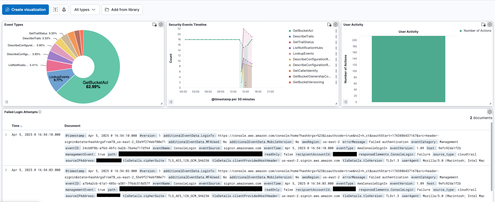

# AWS Security Monitoring System

A comprehensive security monitoring solution for AWS environments using the ELK stack (Elasticsearch, Logstash, Kibana) with GitHub security integration. This project demonstrates modern security engineering practices by analyzing CloudTrail logs to detect potential security threats.

## 🛡️ Features

- Real-time AWS Security Monitoring using CloudTrail logs
- Custom Detection Rules for identifying security threats
- Security Dashboards for visualization and analysis
- GitHub Security Integration with pre-commit hooks and automated scanning
- Dockerized ELK Stack for easy deployment and management

## 🏗️ Architecture

The system consists of three main components:

1. AWS Environment
   - CloudTrail for comprehensive API logging
   - S3 Bucket for log storage
   - Security-relevant AWS services (IAM, Security Groups, etc.)
2. ELK Stack (SIEM)
   - Logstash for log processing and normalization
   - Elasticsearch for indexed storage and searching
   - Kibana for visualization and dashboards
3. GitHub Security
   - Pre-commit hooks to prevent credential leakage
   - GitHub Actions for automated security scanning
   - Dependency vulnerability checking

## 🔍 Security Detection Capabilities

This system can detect various security threats, including:

- Failed login attempts (potential brute force attacks)
- Suspicious IAM permission changes (privilege escalation)
- Security group modifications (network security changes)
- Critical security service disruptions

## 📊 Security Dashboards

The project includes pre-configured security dashboards for:

- Security Overview: High-level metrics and alerts
- User Activity: Tracking user actions across AWS
- IAM Changes: Monitoring permission modifications
- Network Security: Security group and access changes
- Login Activity: Authentication successes and failures

